# CRM - Web
# _About_
> The application is created for a specific customer as a freelance project by me. Powered by [React.js] and [Fusetheme] which is based on [MaterialUI] for client side, [Node.js] and [Firebase] for backend. I am planning to add [MongoDB] support in the future.

## _Features_
- Create user with specified roles to only grant access to desired endpoints.
- Add bank account information to create pro forma invoices.
- Add products - with schema template -, spare parts and keep track of the stock.
- Add schema templates to create .docx and .pdf files.
- Add customer and supplier information.
- Create customer meetings - for sales team -.
- Create product, spare part and service proposals.
- Keep track of product and spare part sales. 
- Create pro forma invoices.
- Create service and installation reports.
- Keep track of warranty information of sold products.
- Send proposals, service and installation report to customer as email.
- Create excel files listing customers, proposals, sales

### _Login_
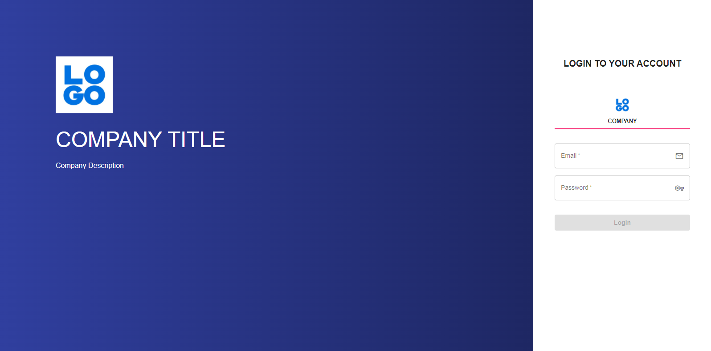

### _User_
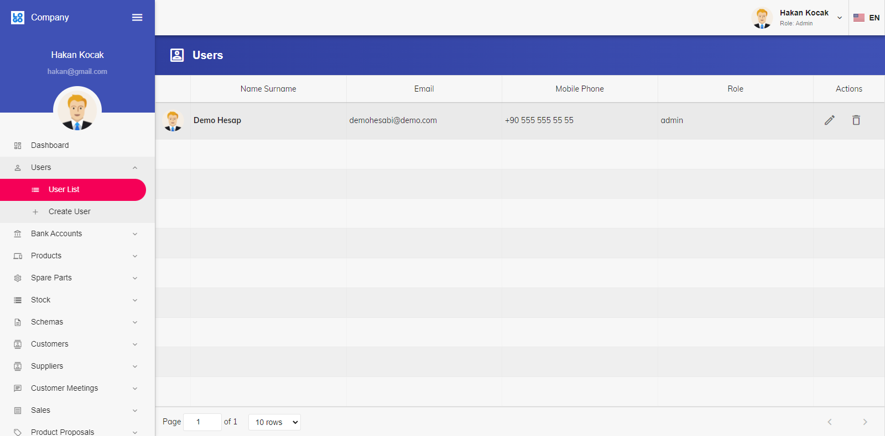
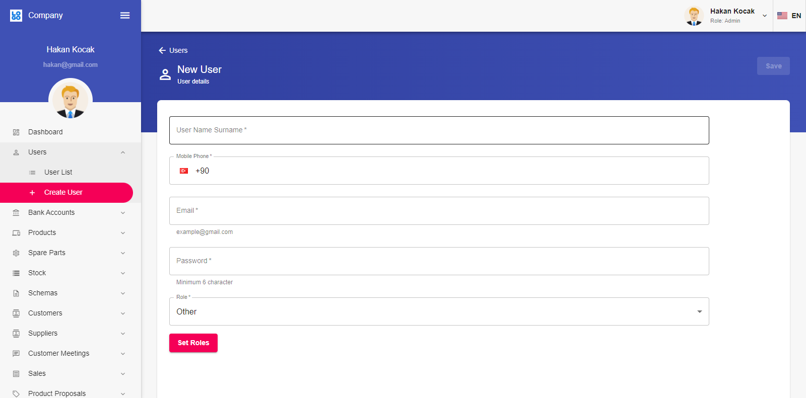
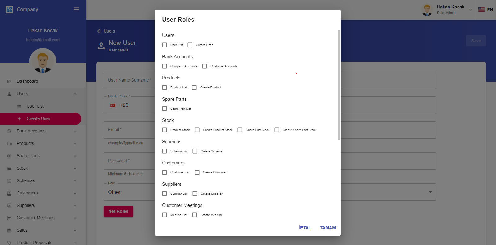

### _Product Details_
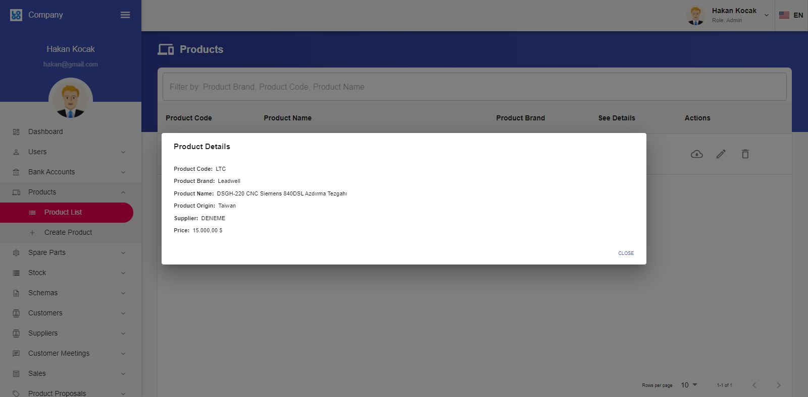

### _Customer Details_
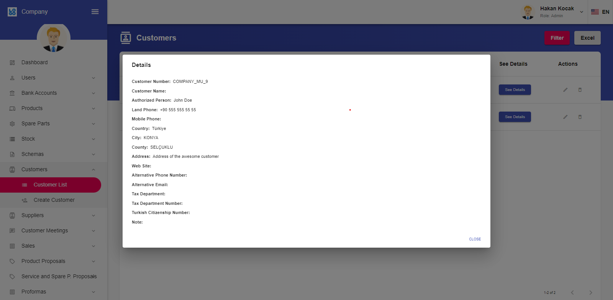

### _Product Proposal_
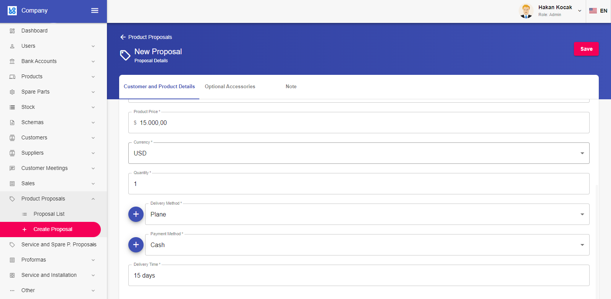
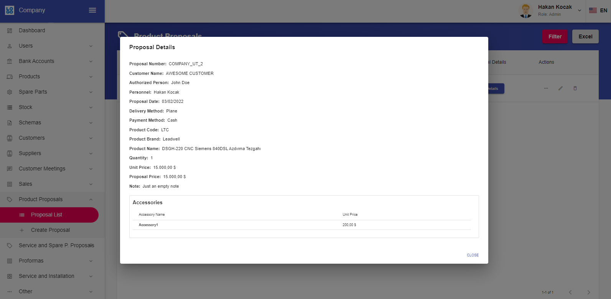

### _Meeting_
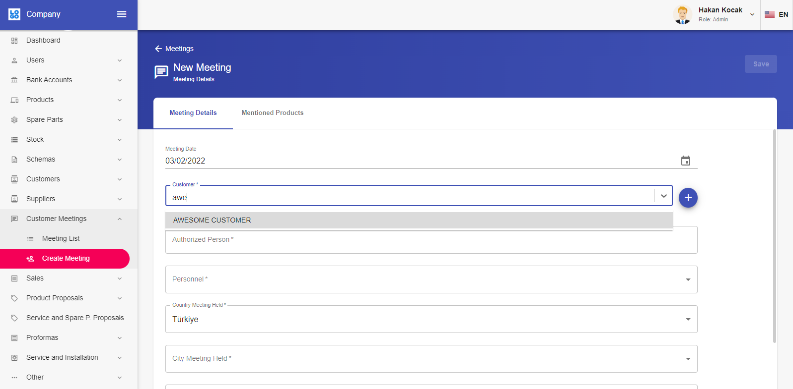
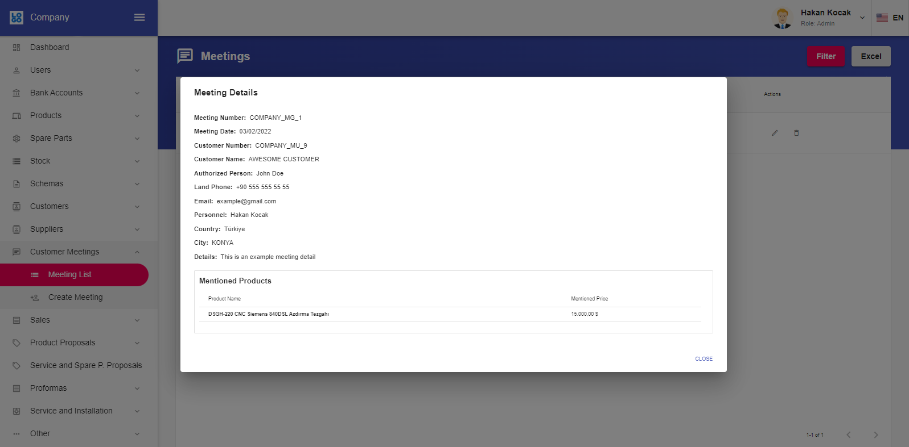

### _Product Sale_
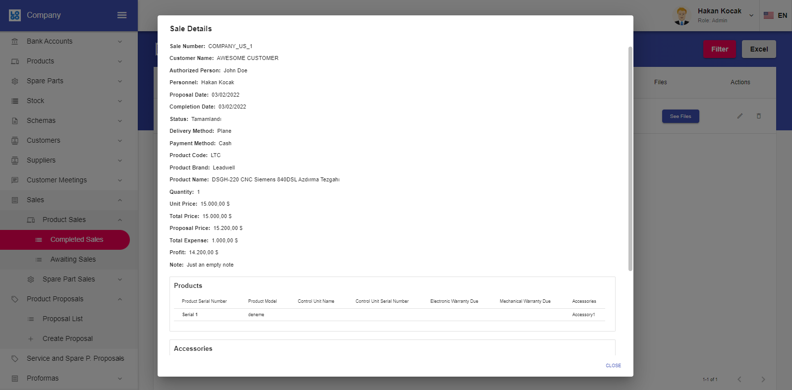

> After installation report for given sale

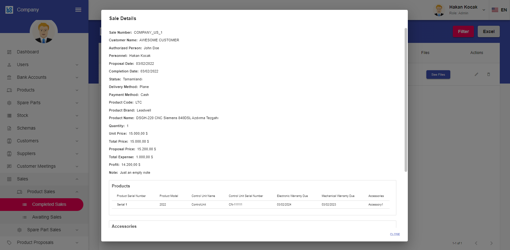

### _Create Installation Report_ 
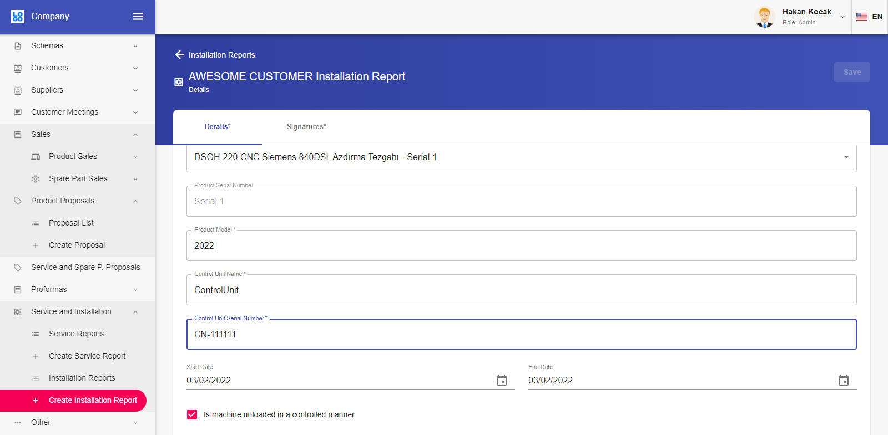
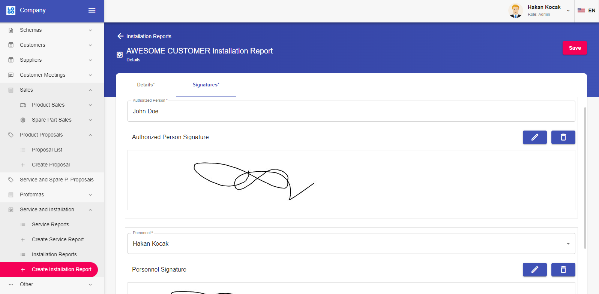

### _Actions_
Example product proposal, installation report and excel file can be found under example-files folder.

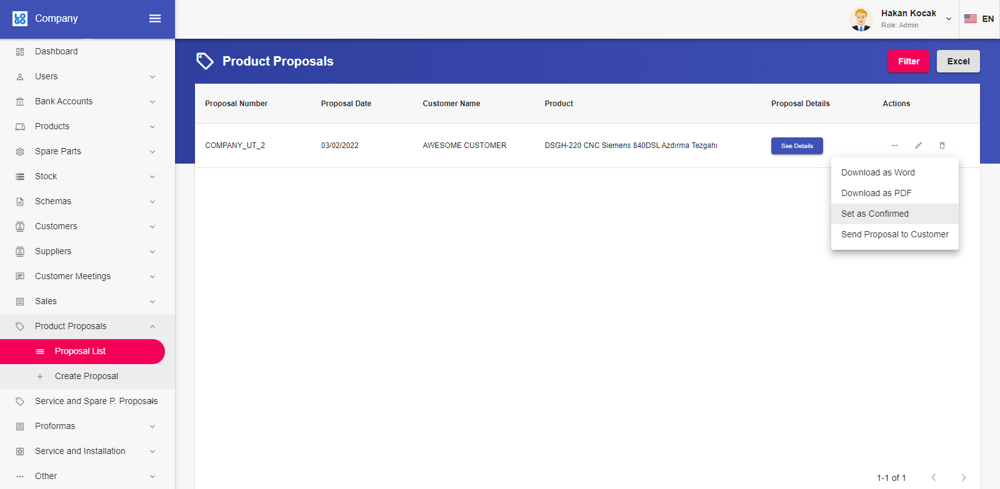
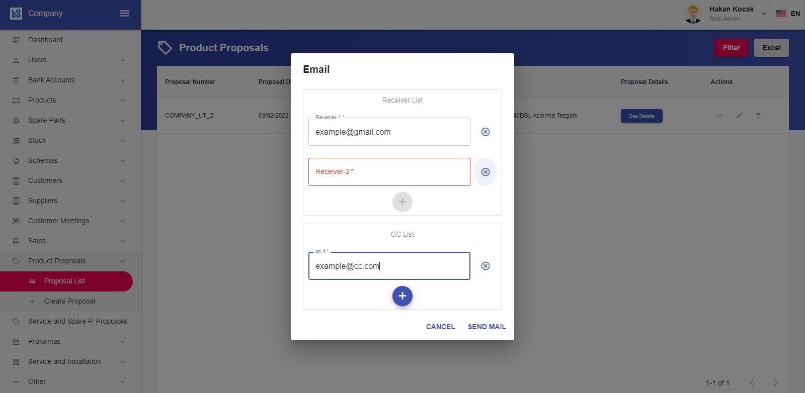

#### _Filter action_
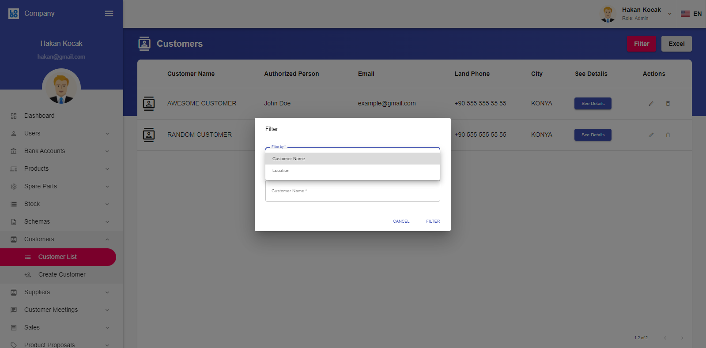

#### _Excel action_
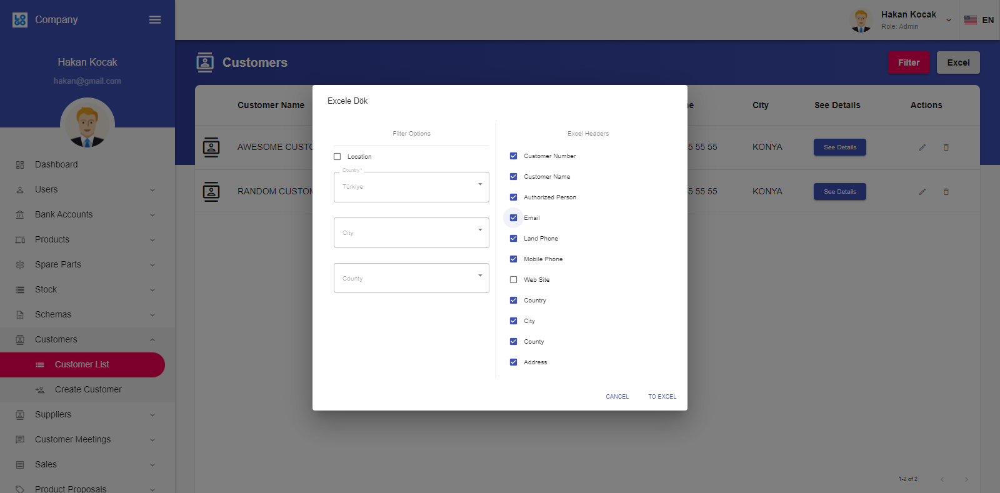

   [React.js]: <https://reactjs.org>
   [Node.js]: <https://nodejs.org>
   [MongoDB]: <https://www.mongodb.com>
   [Express.js]: <https://expressjs.com>
   [Fusetheme]: <http://react-material.fusetheme.com>
   [MaterialUI]: <https://mui.com>
   [Firebase]: <https://firebase.google.com>
